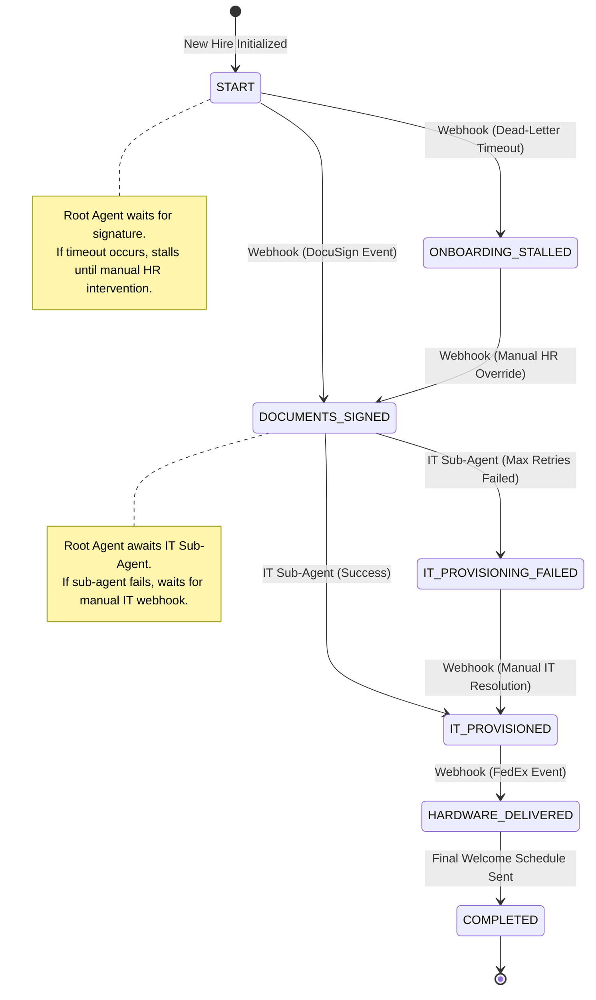
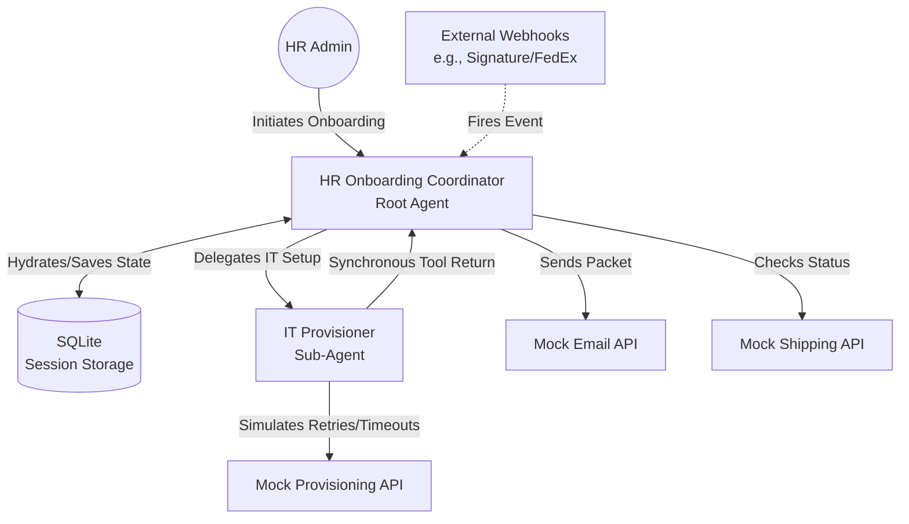

# Technical Design Document: New Hire Onboarding Workflow

## Data Model (State)
The onboarding process relies on a durable state machine stored in local SQLite sessions.
* **`employee_id`** (string): Unique identifier for the new hire.
* **`status`** (enum): `START`, `DOCUMENTS_SIGNED`, `IT_PROVISIONED`, `IT_PROVISIONING_FAILED`, `HARDWARE_DELIVERED`, `ONBOARDING_STALLED`, `COMPLETED`.
* **`hardware_tracking_id`** (string): The mocked shipping tracking ID.
* **`it_accounts_ready`** (boolean): Flag indicating the sub-agent has completed provisioning.

### State Transition Diagram

## Network Architecture & Sub-Agents
* **Root Agent (`hr_onboarding_coordinator`):** Manages the global state machine, sends welcome packets, verifies hardware delivery, and sends the final day-one schedule.
* **Sub-Agent (`it_agent`):** A specialized agent delegated to handle IT account provisioning once documents are signed.
* **Synchronous Sub-Agent Delegation:** Unlike external webhooks that scale the infrastructure to zero during multi-day waits, delegating to a `sub_agent` within the same ADK deployment acts as a synchronous coroutine tool call. The Root Agent's execution loop actively awaits the IT Sub-Agent's completion. The IT Sub-Agent handles API retries and timeouts locally without yielding the container.

## Mocked APIs & Failure Injection
All external systems will be mocked. However, these mocks must simulate real-world unreliability to showcase ADK's resilience, retry logic, and timeout capabilities.
* **`send_welcome_packet`**: Occasionally throws a simulated 503 Service Unavailable error.
* **`provision_software_accounts`**: Simulates long-running API latency (timeouts) or random rate limit (429) errors that the agent must catch and handle.
* **`check_hardware_delivery`**: Returns pending status reliably until the delivery webhook fires.

## Deployment Strategy
* **Pattern:** Prototype First
* **Session Storage:** SQLite (`DatabaseSessionService`) for local persistent sessions.
* **Infrastructure:** No cloud infrastructure (Cloud Run/Agent Runtime) will be scaffolded initially. We will enhance the project later if needed.

## Mid-Level Implementation Details (ADK 2.0)
To build a modern, robust agent network, we will avoid legacy `SequentialAgent` constructs and use the ADK 2.0 `Workflow` API:

1. **Workflow Graph as the State Machine:** The Root Agent will be a `Workflow` instance. The state machine will be implicitly defined by Nodes and Edges (e.g., `edges=[('START', send_packet), (send_packet, wait_signature), ...]`). Conditional routes will handle branching for timeouts and failures.
2. **Native Wait States (HITL):** To implement the "Dead-Letter / Webhook" pauses, nodes will yield a `RequestInput(interrupt_id="...")` event. This natively suspends the workflow graph, scaling to zero safely, until the webhook or HR override resumes the session with the requested input.
3. **Structured Sub-Agent Output:** The IT Sub-Agent will be defined as an `LlmAgent` with an explicit `output_schema` (a Pydantic model containing `success` and `reason`). This enforces strict type safety when the sub-agent returns its result to the Root Workflow.
4. **Native Retries & Timeouts:** We will not write manual `try/except/sleep` retry loops in the mock APIs. We will configure the mock tools using explicit `RetryConfig(max_attempts=5, backoff_factor=2.0)` and strict `timeout` parameters, relying on the ADK graph engine to handle backoffs natively.
5. **Tool Callbacks for Safe Interception:** We will use `after_tool_callback` on the IT Sub-Agent's tools. If a mock API throws a fatal error after exhausting its native retries, the callback will intercept the exception and cleanly format a safe fallback payload, preventing the orchestration loop from crashing.
6. **State Mutation:** Following our universal coding standard, we will prefer emitting `Event(state={"key": "val"})` over directly mutating `ctx.state` to ensure deterministic replaying and safe session hydration.
